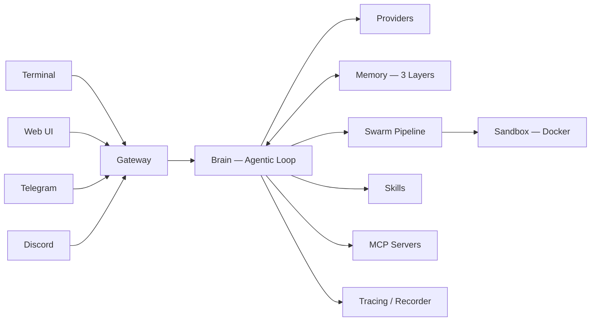

# OpenClaw — NexusMind


> NexusMind is a Python AI agent framework with hierarchical memory, multi-agent swarm pipelines, and self-healing code execution.

[README en francais](README.fr.md)

---

## Why NexusMind

- **3-Layer Memory (MemU)** — Resource → Item → Category with graceful forgetting. Raw data is never deleted; stale items fade in priority while categories auto-reorganize.
- **Swarm Pipeline** — Planner → Coder → Reviewer → Critic with dynamic routing to Security and Tester agents. The Reviewer acts as a smart router, delegating to specialists on demand.
- **Self-Healing Code** — Sandbox execution catches runtime errors and feeds them back to the LLM with full environment context. Up to 3 auto-correction attempts before surfacing the failure.

---

## Quick Start

```bash
git clone https://github.com/darkoneill/LAB.git && cd LAB
pip install -e ".[all]"
python run.py wizard    # first-time interactive setup
python run.py           # terminal + gateway + web UI
python run.py doctor    # system health check
```

### Run Modes

| Command                | Description                     |
|------------------------|---------------------------------|
| `python run.py`        | Terminal + Gateway (default)    |
| `python run.py terminal` | Terminal UI only              |
| `python run.py gateway`  | REST/WebSocket API only       |
| `python run.py telegram` | Telegram bot                  |
| `python run.py discord`  | Discord bot                   |
| `python run.py doctor`   | Rich diagnostic report        |
| `python run.py wizard`   | Re-run setup wizard           |

---

## Architecture



---

## Features

| Capability               | NexusMind | Typical Agent Frameworks |
|--------------------------|:---------:|:------------------------:|
| **3-layer hierarchical memory** | **Yes** | Flat vector store |
| **Multi-agent swarm (7 roles)** | **Yes** | Single agent or basic delegation |
| **Self-healing sandbox**        | **Yes** | Manual re-run |
| Human-in-the-loop MCP approval  | Yes     | Rare |
| Trace replay from failure        | Yes     | No |
| Agentic cron (scheduled tasks)  | Yes     | No |
| Streaming SSE + WebSocket        | Yes     | Varies |
| Multi-provider failover          | Yes     | Partial |

---

## Providers

| Provider     | SDK / Protocol       | Tool Calling |
|-------------|----------------------|:------------:|
| Anthropic   | `anthropic` SDK      | Yes          |
| OpenAI      | `openai` SDK         | Yes          |
| Gemini      | REST via `httpx`     | Yes          |
| OpenRouter  | OpenAI-compatible    | Yes          |
| Ollama      | OpenAI-compatible    | Auto-detect  |
| Custom      | OpenAI-compatible    | Configurable |

---

## Channels

| Channel   | Protocol    | Access Control        |
|-----------|-------------|-----------------------|
| Terminal  | stdin/stdout | Local only           |
| Web UI    | HTTP + WS   | API key auth         |
| Telegram  | Bot API     | User allowlist       |
| Discord   | Gateway     | User + guild allowlist |

---

## Deployment

### Local Development

```bash
pip install -e ".[dev]"
pytest tests/ -v          # 654 tests
python run.py doctor      # verify setup
python run.py             # start
```

### Docker

```bash
docker compose up -d
```

### VPS (Hostinger / OVH)

```bash
sudo ./docker/setup-vps.sh
```

---

## Configuration

All settings live in `openclaw/config/default.yaml` with user overrides in `config/user.yaml` (auto-generated by the wizard). Environment variables override both:

```bash
ANTHROPIC_API_KEY=sk-ant-...
OPENAI_API_KEY=sk-...
GEMINI_API_KEY=...
OPENROUTER_API_KEY=...
OPENCLAW_GATEWAY__PORT=18789
OPENCLAW_LOGGING__LEVEL=DEBUG
```

Secrets in `user.yaml` are encrypted at rest using Fernet symmetric encryption.

For full configuration reference, see the default config: [`openclaw/config/default.yaml`](openclaw/config/default.yaml).

---

## Diagnostics

Run `python run.py doctor` to check system health:

```
┌──────────┬────────┬─────────────────────────────┬─────────┐
│ Check    │ Status │ Message                     │ Details │
├──────────┼────────┼─────────────────────────────┼─────────┤
│ config   │   OK   │ Configuration valid          │         │
│ providers│   OK   │ Providers active: anthropic  │         │
│ memory   │   OK   │ Memory store writable        │         │
│ disk     │   OK   │ 25.1 GB free (84% free)      │         │
│ skills   │   OK   │ 4 skill(s) loaded            │         │
│ channels │   OK   │ No external channels enabled  │         │
│ sandbox  │   OK   │ Docker daemon reachable       │         │
└──────────┴────────┴─────────────────────────────┴─────────┘
System healthy.
```

Exit code is `0` when healthy, `1` otherwise — suitable for CI and monitoring scripts.

---

## Contributing

See [CONTRIBUTING.md](CONTRIBUTING.md) for the fork → branch → PR workflow and commit conventions.

---

## License

[MIT](LICENSE)
